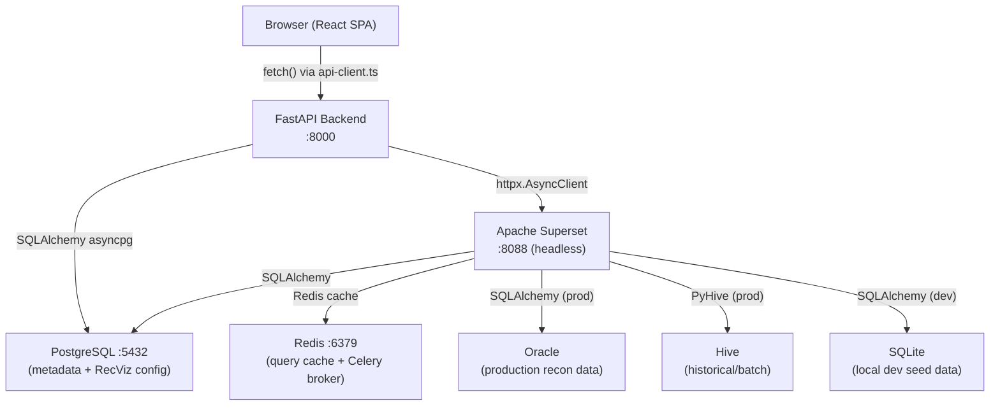

<!-- generated-by: gsd-doc-writer -->
# Architecture

RecViz is a visualization and analytics platform for reconciliation data. It uses Apache Superset as a headless query engine behind a custom React frontend and a FastAPI sidecar backend. The system follows a three-tier layered architecture: a browser-based SPA sends requests to a FastAPI backend, which proxies queries to Superset and returns results. The frontend never communicates with Superset directly.

---

## Component Diagram



### Component Responsibilities

| Component | Role |
|-----------|------|
| **React SPA** | UI rendering, client-side state (Zustand), server state caching (TanStack Query), chart rendering (AG Charts + ECharts) |
| **FastAPI Backend** | API gateway, Superset proxy, SQL template engine, data source config store, multi-source merge, database lifecycle management |
| **Apache Superset** | Headless SQL execution engine via REST API, query caching, database connection management. No Superset UI is exposed to users. |
| **PostgreSQL** | Superset internal metadata storage and RecViz's own config tables (`recviz_dashboards`, `recviz_data_sources`) |
| **Redis** | Superset query result cache (db 0-1), Celery broker (db 2), Celery results backend (db 3), SQL Lab results (db 4) |

---

## Data Flow

A typical dashboard load follows this sequence from entry point to rendered output:

1. **Route resolution.** The user navigates to `/$dashboardId`. TanStack Router resolves the file-based route at `routes/_app/dashboards/$dashboardId.tsx`, which extracts the dashboard ID from the URL.

2. **Config fetch.** The `useDashboardConfig` hook fires a `GET /api/dashboards/{id}` request via the `api-client.ts` fetch wrapper. FastAPI's `ConfigStore` service reads the dashboard config from the `recviz_dashboards` PostgreSQL table and returns the full `DashboardConfig` JSON (filters, KPIs, charts, grids, layout).

3. **Filter initialization.** `DashboardRenderer` receives the config and calls `useFilterStore.initializeFilters()` with default values from the config. URL query parameters (`filter.*=value`) override defaults. Locked filters (`filter.lock=id1,id2`) are marked immutable.

4. **KPI queries.** `useDashboardKpis` posts `POST /api/dashboards/{id}/kpis` with the applied filter values. The backend iterates each KPI's data sources, resolves the target database (static or dynamic routing), builds SQL from the template with filter substitution, and executes via `SupersetClient.execute_sql()`. Results are aggregated and trend percentages computed by cross-referencing KPI values.

5. **Chart queries.** `ConfigChartGrid` renders charts in a CSS grid. Charts with `sourceType: 'query'` each fire `POST /api/data-sources/{id}/query` independently. Charts with `sourceType: 'kpi_values'` build their data from the already-fetched KPI results with zero additional network calls. `ChartFactory` routes each chart's `vizType` to either `AgChartWrapper` (standard types) or `EChartWrapper` (exotic types).

6. **Grid queries.** `ConfigDataGrid` renders AG Grid tables. Single-source grids query via `POST /api/data-sources/{id}/query`. Multi-source grids query via `POST /api/data-sources/merge`, which executes each source independently and joins results in Python using `MergeEngine`. Grids support conditional visibility via `visibleWhen` expressions evaluated against KPI values.

7. **Caching.** TanStack Query caches all responses client-side with a 5-minute stale time and 30-minute garbage collection time. Superset caches query results server-side in Redis with a 10-minute TTL for data queries.

### Query Execution Detail

```
Frontend                    FastAPI                        Superset
  │                           │                              │
  │  POST /data-sources/      │                              │
  │  {id}/query               │                              │
  │  {filters: {...}}         │                              │
  │ ─────────────────────────>│                              │
  │                           │  1. Resolve data source      │
  │                           │     config from PostgreSQL   │
  │                           │                              │
  │                           │  2. Resolve database:        │
  │                           │     static → fixed name      │
  │                           │     dynamic → filter lookup  │
  │                           │                              │
  │                           │  3. DatabaseRegistrar        │
  │                           │     .resolve(name) → ID      │
  │                           │                              │
  │                           │  4. Build SQL:               │
  │                           │     template + filter subs   │
  │                           │     + dialect adaptation     │
  │                           │                              │
  │                           │  POST /api/v1/sqllab/        │
  │                           │  execute/                    │
  │                           │  {database_id, sql}          │
  │                           │ ─────────────────────────────>│
  │                           │                              │  Execute SQL
  │                           │                              │  against target DB
  │                           │         {data, columns}      │
  │                           │<─────────────────────────────│
  │                           │                              │
  │    {columns, rows,        │                              │
  │     row_count, truncated} │                              │
  │<──────────────────────────│                              │
```

---

## Key Abstractions

### Frontend

| Abstraction | File | Purpose |
|-------------|------|---------|
| `ChartFactory` | `frontend/src/components/charts/chart-factory.tsx` | Routes `vizType` to `AgChartWrapper` or `EChartWrapper`. Forwards a unified `ChartRef` for export/fullscreen. |
| `DashboardRenderer` | `frontend/src/components/dashboard/dashboard-renderer.tsx` | Orchestrates a config-driven dashboard: initializes filters, renders filter bar, KPI row, chart grid, and data grid in order. |
| `ChartWrapperProps` | `frontend/src/types/chart.ts` | Unified interface consumed by both AG Charts and ECharts wrappers: `data`, `config` (vizType, categoryKey, valueKeys), `title`, `onChartClick`, `activeSelection`. |
| `DashboardConfig` | `frontend/src/types/dashboard-config.ts` | TypeScript type defining filters, KPIs, charts, grids, layout, and feature flags (crossFilter, drillDown). |
| `useFilterStore` | `frontend/src/stores/filter-store.ts` | Zustand store for generic filter values (`Record<string, FilterValue>`), locked filters, applied snapshot, and cross-filters. |
| `useDrillStore` | `frontend/src/stores/drill-store.ts` | Zustand store for drill-down navigation: source chart ID and drill level stack. |
| `api` | `frontend/src/lib/api-client.ts` | Fetch-based HTTP client with automatic `snake_case` to `camelCase` key transformation (skips `rows`, `columns`, `data`, `config` keys to preserve DB column names). |
| `queryClient` | `frontend/src/lib/query-client.ts` | TanStack Query client configured with 5-minute stale time, 30-minute GC time, 1 retry, no refetch on window focus. |

### Backend

| Abstraction | File | Purpose |
|-------------|------|---------|
| `SupersetClient` | `backend/app/services/superset_client.py` | Async HTTP wrapper for Superset REST API v1. Handles JWT auth with auto-refresh (25-min cycle), CSRF tokens, and automatic retry on 401. |
| `QueryEngine` | `backend/app/services/query_engine.py` | SQL template engine. Resolves databases (static/dynamic routing), builds SQL from templates with filter substitution and dialect adaptation (Oracle, PostgreSQL, SQLite), executes via Superset. |
| `DatabaseRegistrar` | `backend/app/services/database_registrar.py` | Syncs logical database names from `databases.json` into Superset at startup. Caches name-to-Superset-ID mapping with 30-second refresh cooldown and negative cache. |
| `ConfigStore` | `backend/app/services/config_store.py` | Reads dashboard and data source configs from `recviz_dashboards` and `recviz_data_sources` PostgreSQL tables. Session-scoped (one instance per request). |
| `MergeEngine` | `backend/app/services/merge_engine.py` | Python-level hash join for multi-source queries. Supports `outer_join` and `inner_join`. Fold-left merge for 3+ sources. |
| `ConnectionStatusTracker` | `backend/app/services/connection_status.py` | In-memory tracker for database health. Marks databases as `connected`, `unreachable`, or `untested`. Resets on process restart. |
| Dependency injection | `backend/app/core/dependencies.py` | FastAPI `Depends()` providers for `SupersetClient`, `ConfigStore`, `QueryEngine`, `DatasetSyncService`, and `ResolvedDataSourceDep` (resolves data source by path param with 404 handling). |

---

## Directory Structure Rationale

```
RecViz/
├── frontend/                  # React SPA — all client code
│   └── src/
│       ├── components/
│       │   ├── ui/            # Shadcn/ui primitives (owned code, not a dependency)
│       │   ├── layout/        # Shell: sidebar, header, theme, command palette
│       │   ├── dashboard/     # Config-driven dashboard components
│       │   ├── charts/        # Chart wrappers, factory, builder
│       │   ├── datasets/      # Dataset CRUD UI (list, editor, column grid)
│       │   ├── explorer/      # SQL IDE (Monaco editor, schema browser, results)
│       │   ├── settings/      # Data source management UI
│       │   ├── embed/         # Chromeless embed topbar
│       │   ├── grid/          # Legacy AG Grid components (unused)
│       │   └── shared/        # Error boundary, page transitions, count animation
│       ├── routes/            # TanStack Router file-based route definitions
│       ├── hooks/             # Custom React hooks wrapping TanStack Query calls
│       ├── stores/            # Zustand stores (filter-store, drill-store)
│       ├── lib/               # Utilities: API client, chart themes, formatters,
│       │                      #   cross-filter logic, query client config
│       └── types/             # Shared TypeScript interfaces and type unions
├── backend/                   # FastAPI sidecar
│   └── app/
│       ├── api/               # Route handlers — thin, delegate to services
│       ├── services/          # Business logic: Superset client, query engine,
│       │                      #   config store, merge engine, DB registrar
│       ├── models/            # Pydantic v2 models for requests, responses, configs
│       ├── core/              # FastAPI dependency injection and error types
│       ├── config/            # JSON config files for dashboards, data sources,
│       │                      #   and database connection definitions
│       ├── db/                # SQLAlchemy async engine, session factory, ORM models
│       │   └── models/        # ORM models: RecvizDashboard, RecvizDataSource, etc.
│       └── migrations/        # Alembic migrations (separate version table from Superset)
├── superset/                  # Superset container config
│   ├── superset_config.py     # Redis cache, PostgreSQL metadata, CORS, Celery,
│   │                          #   Oracle driver shim (oracledb as cx_Oracle)
│   ├── Dockerfile             # Python 3.12-slim + Superset + DB drivers
│   └── superset-entrypoint.sh # Waits for Postgres, runs migrations, creates admin
├── docker/
│   └── init-db.sql            # PostgreSQL init (creates recon_data database)
├── docker-compose.yml         # PostgreSQL 16 + Redis 7 + Superset container
├── seed/                      # Dev seed data scripts (create recon DB,
│                              #   register Superset databases/datasets)
└── scripts/                   # Setup utilities: generate seed DB, seed Postgres,
                               #   configure Superset for local dev
```

**Why this structure:**

- **`frontend/` and `backend/` are siblings**, not nested. Each has its own dependency management (`package.json` vs `requirements.txt`), its own dev server, and its own build pipeline. This enables independent deployment.

- **`components/` is organized by domain**, not by technical role. Dashboard components live together, chart components live together, explorer components live together. This mirrors the pages they serve and reduces cross-directory imports.

- **`hooks/` are separated from components** because a single hook (e.g., `use-dashboard-kpis`) may be consumed by multiple unrelated components (`ConfigKpiRow`, `ConfigChartGrid`, `ConfigDataGrid`).

- **`services/` in the backend encapsulates all external I/O.** Route handlers are thin (validate input, call service, return response). This makes services independently testable and keeps route files focused on HTTP concerns.

- **`config/` in the backend stores JSON definitions** for dashboards and data sources. In local dev, these are seeded into PostgreSQL at startup. This approach decouples dashboard layout from Superset metadata.

- **`superset/` is isolated** because Superset runs as its own process (Docker container in dev, separate service in production). The config and Dockerfile live together so the container is self-contained.

---

## Filtering Model

The system implements a three-tier filtering architecture:

### Tier 1: Global Filters (Server-Side)

Global filters live in the filter bar at the top of each dashboard. When the user clicks "Apply", the `applied` snapshot in `useFilterStore` updates, which triggers TanStack Query refetches (the applied filters are part of query keys). The backend receives filter values in POST bodies, substitutes them into SQL templates via `QueryEngine._build_sql()`, and Superset executes the filtered query.

Filter types: `single-select`, `multi-select`, `preset-range`. Filters support cascading dependencies (`dependsOn`) where changing a parent filter refetches child filter options via `GET /api/data-sources/{id}/distinct/{column}`.

### Tier 2: Cross-Filters (Client-Side)

Cross-filtering is triggered by clicking a data point in a chart. The click handler writes a `CrossFilter` (sourceChartId, column, value) to the Zustand filter store. Other charts read cross-filters and apply them client-side using `useMemo` over cached data. This produces zero additional network calls. The source chart excludes its own cross-filter to avoid filtering itself.

### Tier 3: Drill-Down (Hybrid)

Drill-down navigates deeper into data by clicking chart elements. The drill store tracks a stack of `DrillLevel` objects (column + value pairs). At aggregated levels, drill-down re-aggregates cached data client-side. At detail level (depth >= 3), a backend call fetches row-level data.

---

## Database Routing

The backend supports two database routing strategies configured per data source:

- **Static routing.** The data source config specifies a fixed `database` name (e.g., `superset_db_reconmgmt`). Every query for this data source always hits the same database.

- **Dynamic routing.** The data source config specifies a `route_by_filter` key and a `mapping` of filter values to database names. For example, the `tlm_instance` filter value `TLMP_CONSUMER` maps to `superset_db_TCOSPRD`. The `QueryEngine` reads the filter value at query time and resolves the correct database. This enables a single data source config to query different Oracle instances based on user selection.

In both cases, `DatabaseRegistrar.resolve()` converts the logical database name to a Superset numeric ID. The registrar syncs `databases.json` into Superset at startup and maintains an in-memory cache.

---

## Authentication and Session Management

The FastAPI backend authenticates to Superset at startup using username/password credentials (`POST /api/v1/security/login`), receiving a JWT access token. The `SupersetClient` auto-refreshes this token every 25 minutes (Superset's default token expiry is 30 minutes) and retries once on 401 responses. CSRF tokens are also fetched and included in mutating requests.

There is no end-user authentication implemented. The frontend communicates with FastAPI without credentials. CORS is configured to allow requests from `localhost:5173` (Vite dev server), `localhost:3000`, and `localhost:4200`.

---

## Caching Strategy

Caching operates at two levels:

**Client-side (TanStack Query):** All API responses are cached in the browser with a 5-minute stale time. During filter transitions, `placeholderData` shows previous results while new data loads. Query keys include applied filters, so changing filters produces a cache miss and triggers a fresh fetch.

**Server-side (Redis via Superset):** Superset caches query results in Redis with a 5-minute default timeout for metadata and 10-minute timeout for data queries. The cache key prefix is `recviz_data_`. SQL Lab results are stored in Redis db 4 via `cachelib.RedisCache`.

---

## Technology Stack Summary

### Frontend

| Concern | Technology | Version |
|---------|-----------|---------|
| Framework | React | 19.2 |
| Build tool | Vite | 7.3 |
| Language | TypeScript | 5.9 (strict) |
| UI primitives | Shadcn/ui + Radix | owned code |
| Styling | Tailwind CSS | 4.1 |
| Data grid | AG Grid Enterprise | 35.0 |
| Charts (primary) | AG Charts Enterprise | 13.0 |
| Charts (exotic) | ECharts | 6.0 |
| Routing | TanStack Router | 1.x (file-based) |
| Server state | TanStack Query | 5.x |
| Client state | Zustand | 5.x |
| Animations | Motion (`motion/react`) | 12.x |
| SQL editor | Monaco Editor | 4.7 |

### Backend

| Concern | Technology | Version |
|---------|-----------|---------|
| Framework | FastAPI | 0.128 |
| ASGI server | Uvicorn | 0.40 |
| Language | Python | 3.12+ |
| Validation | Pydantic | 2.12 |
| HTTP client | httpx | 0.28 |
| ORM | SQLAlchemy (async) | 2.0 |
| Migrations | Alembic | 1.18 |
| Async driver | asyncpg | 0.31 |

### Infrastructure

| Concern | Technology | Version |
|---------|-----------|---------|
| Query engine | Apache Superset | 6.0.0 |
| Metadata DB | PostgreSQL | 16 (Docker) |
| Cache / broker | Redis | 7 (Docker) |
| Container | Docker Compose | PostgreSQL + Redis + Superset |
